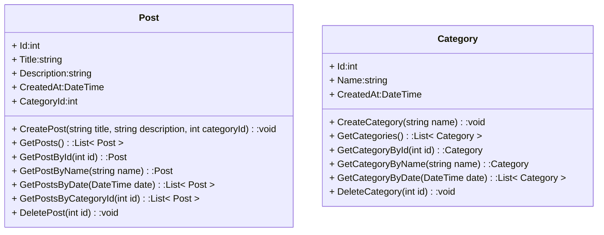

### Task 1

Create a Post class using these methods.
1. `CreatePost`: a method that takes a `title`, `description`, and `categoryId` as arguments and creates a new `Post` with the specified parameters.

2. `GetPosts`: a method that returns a `List<Post>`.

3. `GetPostById`: a method that takes a `postId` as an argument and returns a single `Post`.

4. `GetPostsByDate`: a method that takes a date as an argument and returns a `List<Post>` published on that date.

5. `GetPostCategoryId`: a method that takes a `categoryId` as an argument and returns a `List<Post>`.

6. `DeletePost`: a method that takes a `postId` as an argument and deletes it from the `List<Post>`.

Also implement the methods of the `Category` class in the same way.

##

Создайте класс Post, используя эти методы.
1. `CreatePost`: метод, который принимает `title`, `description` и `categoryId` в качестве аргументов и создает новое `Post` с указанными параметрами.

2. `GetPosts`: метод, который возвращает `List<Post>`.

3. `GetPostById`: метод, который принимает `postId` в качестве аргумента и возвращает один `Post`.

4. `GetPostsByDate`: метод, который принимает дату в качестве аргумента и возвращает `List<Post>`, опубликованный в эту дату..

5. `GetPostCategoryId`: метод, который принимает `categoryId` в качестве аргумента и возвращает `List<Post>`.

6. `DeletePost`: a method that takes a `postId` as an argument and deletes it from the `List<Post>`

Аналогично реализуем и методы класса `Category`.

##

Бо истифода аз ин усулҳо синфи `Post` эҷод кунед.
1. `CreatePost`: Усуле, ки `title`, `description` ва `categoryId`-ро ҳамчун аргумент қабул мекунад ва бо параметрҳои муайяншуда `Post`-и нав эҷод мекунад.

2. `GetPosts`: усуле, ки `List<Post>`-ро бармегардонад.

3. `GetPostById`: Усуле, ки `postId`-ро ҳамчун далел қабул мекунад ва як `Post`-ро бармегардонад.

4. `GetPostsByDate`: Усуле, ки санаро ҳамчун далел қабул мекунад ва `List<Post>`-ро, ки дар он сана нашр шудааст, бармегардонад.

5. `GetPostCategoryId`: Усул, ки `categoryId`-ро ҳамчун аргумент гирифта, `List<Post>`-ро бармегардонад.

6. `DeletePost`: усуле, ки `postId`-ро ҳамчун аргумент мегирад ва онро аз `List<Post>` нест мекунад

Усулҳои синфи `Category`-ро ба ҳамин тарз татбиқ кунед.
##
Here's an example of how to use the `Post` class:

Пример использования класса `Post`:

Намунаи истифодаи синфи `Post`:

```csharp
// Create a new post
Post.CreatePost("Post Title", "Post Content");

// Get a list of all posts by topic
List<Post> postsByName = Post.GetPostsByName("Softclub");

// Get a list of all posts by author
List<Post> posts = Post.GetPosts();

// Get a list of all posts by date
List<Post> postsByDate = Post.GetPostsByDate(LocalDate.now());

// Delete a post
Post.DeletePost(1);
```
